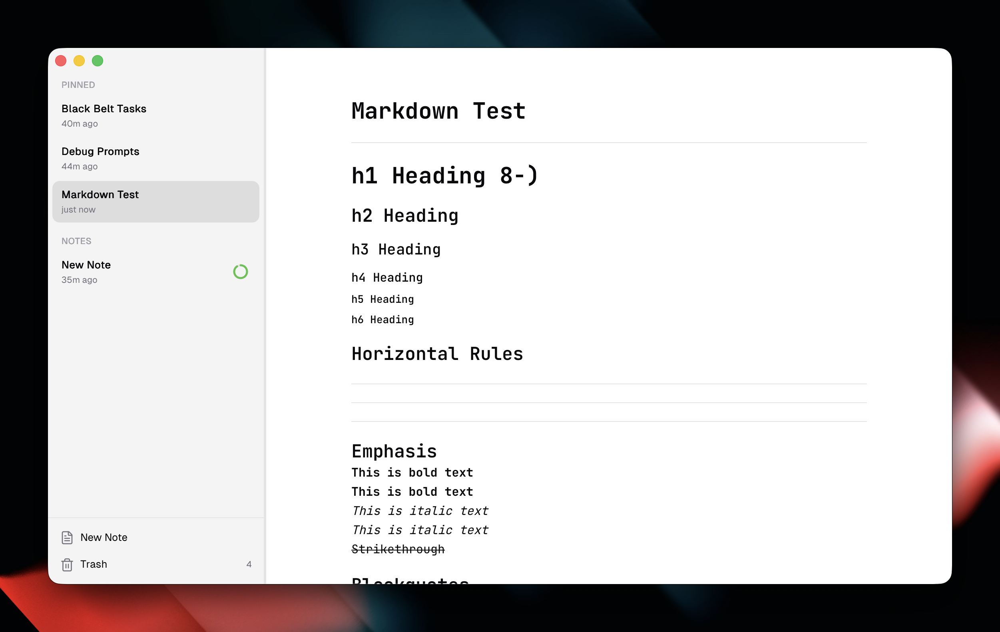

# Augenblick

A note-taking app where your notes disappear—on purpose.

## Why I Built This

Truth be told, I have ADHD and my notes are a mess. Untitled documents everywhere. Files named `meeting-notes-v239-FINAL-actually-final.md`. Notes I'll "organize later" that never get organized.

I wanted something different: an app that assumes notes are temporary by default. Write it down, use it, let it go. If something's worth keeping, pin it or save it somewhere real. Everything else fades away after a week.

It's not about losing information, it's about not drowning in it.

## Features

- **Auto-expiring notes** — Notes move to trash after 7 days of inactivity (configurable from 6 hours to 30 days)
- **Pin to keep** — Pin important notes to prevent expiry (up to 5)
- **Markdown editor** — Tables, task lists, code blocks with syntax highlighting, images
- **Draft vs Saved** — Drafts live in the app; save externally when you need permanence
- **Trash buffer** — Deleted notes stick around for 30 days, just in case
- **Command palette** — Quick access to everything with `⌘K`
- **Visual expiry ring** — Color-coded indicator shows how much time a note has left
- **Dark, light, or system theme**

## Screenshots

## Keyboard Shortcuts

| Action          | Shortcut |
| --------------- | -------- |
| New note        | `⌘N`     |
| Save            | `⌘S`     |
| Save As         | `⇧⌘S`    |
| Open/Import     | `⌘O`     |
| Pin/Unpin       | `⌘P`     |
| Trash note      | `⌘W`     |
| Command palette | `⌘K`     |
| Settings        | `⌘,`     |

## Built With AI

This app is 100% vibe coded. No traditional development—just conversations with AI.

Built entirely with [Codex CLI](https://github.com/openai/codex), [Claude Code](https://claude.ai/code), and [Cursor](https://cursor.com).

## Tech Stack

- [Tauri](https://tauri.app) — Desktop framework (Rust backend)
- [React](https://react.dev) — UI
- [Zustand](https://zustand-demo.pmnd.rs) — State management
- [Tiptap](https://tiptap.dev) — Markdown editor
- SQLite — Local storage

## License

MIT
